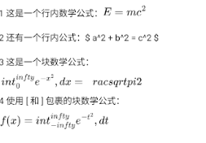

# react-native-markdown-math-view

## 说明

将markdown中的数学公式渲染成SVG,而不是使用webview
支持行内分隔符`$...$`、`\\(...\\)` 和块分隔符`$$...$$`、`\\[...\\]`

## 案例数据


```js
import React from 'react'
import MarkdownMathView from 'react-native-markdown-math-view'

const markdownContent = `
1 这是一个行内数学公式：\\(E = mc^2\\) 

2 还有一个行内公式：$ a^2 + b^2 = c^2 $ 

3 这是一个块数学公式：
$$
\int_{0}^{\infty} e^{-x^2} \, dx = \frac{\sqrt{\pi}}{2}
$$

4 使用 \\[ 和 \\] 包裹的块数学公式：
\\[
f(x) = \int_{-\infty}^{\infty} e^{-t^2} \, dt
\\]
`

const Index = () => {
  return <MarkdownMathView>{markdownContent}</MarkdownMathView>
}

export default Index

```


